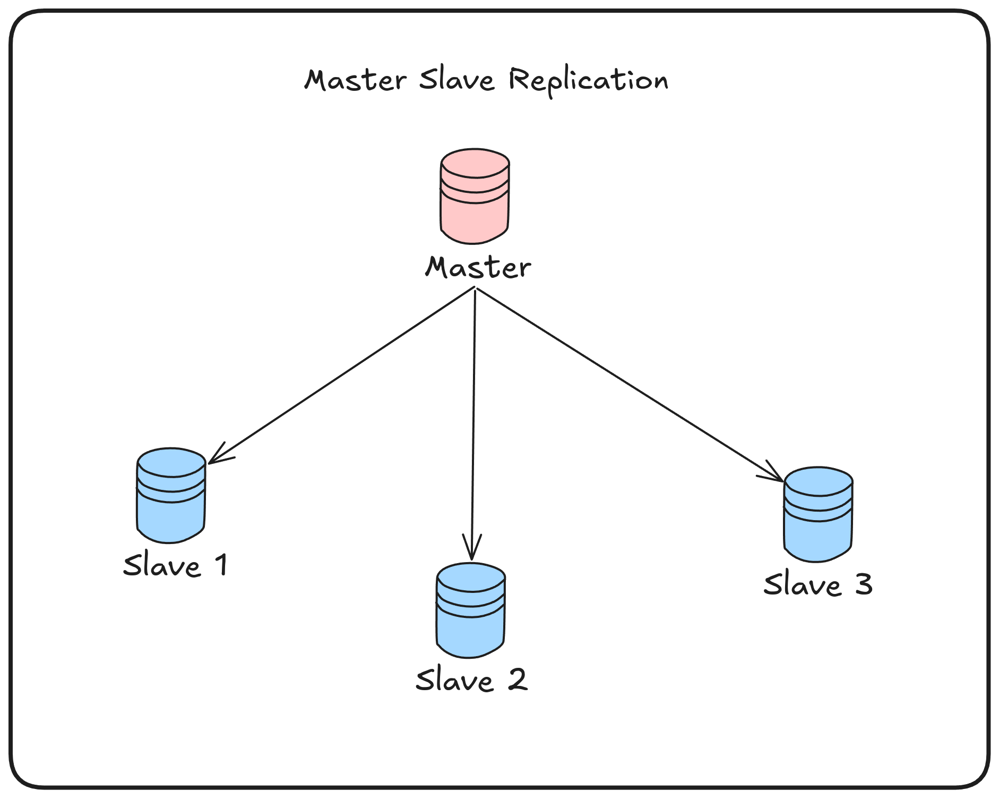

## Intro

Hi there!🌟. In this article I will show You how to setup MariaDB master-slave replication with Docker. I will prepare and configure a replication environment that is portable and manageable.

### What is Master-Slave Replication?

### Why Docker?

### Create Master-Slave Container

### Configure Replication

#### Conclusion

References:
- https://mariadb.com/kb/en/setting-up-replication/

